# Bangla Book Recommender

**Find Bangla books by the taste you describe.** Ask for *"a slow, dark mystery set in old Dhaka"*, or *"books like Sonar Kella"*,
in Bangla, English or romanised Bangla, and get matching books with a short reason for each.

A retrieval-augmented recommendation system over a catalogue of **14,155 Bangla fiction works** (novels, stories, poetry, drama, comics), built from open research datasets,
Wikipedia and Wikidata. It covers Bangladeshi, West Bengal (Indian Bengali) and translated books.

> **Status:** data collection ✅ · cleaning S1–S12 ✅ (193 tests, 40/40 validation checks) · labelling 🔜 · retrieval 🔜
> See [PROGRESS.md](PROGRESS.md) for a detailed checklist.

---

## Why
Bangla readers find books through Facebook groups ("suggest me a book like…") and bookstore categories.
Existing "similar books" features (Rokomari, Goodreads) are based on categories and purchases, not on what a book is *like*.
Research on Bangla book recommendation covers interaction data only ([RokomariBG](https://arxiv.org/abs/2602.12129)).
As far as we can find, **no published work or product offers natural-language, taste-based search for Bangla books** (see the [literature review](docs/09-literature-review.md)).

## How it will work
```
query (bn / en / romanised)
  → LLM query understanding: search text + filters (genre, audience, era, origin)
  → hybrid retrieval (dense + sparse, bge-m3) over each book's premise + taste tags
  → top ~30 candidates
  → LLM rerank → top 5 with a reason for each, in the user's language
```
### Architecture
Legend: **green** = built · **yellow** = partial · **grey dashed** = planned · **blue** = UX states from the [UX plan](docs/12-ux-plan.md).
Sources for both diagrams: [`diagrams/*.mmd`](diagrams/). An editable `.excalidraw` file sits next to each one.

**Data pipeline**


**Query flow (planned)**


Each book is stored as **metadata only** (never full text):
title and author (with romanised aliases), a spoiler-free premise written from source text,
and taste tags from a fixed bilingual vocabulary: genre, mood, pace, themes, setting, era, tone.
Details: [data model](docs/03-data-model.md) · [tag vocabulary](docs/04-tag-vocabulary.md).

---

## Data

### Sources collected
| Source | What we get | Raw format | Size | License |
|---|---|---|---|---|
| [RokomariBG](https://github.com/backlashblitz/Bangla-Book-Recommendation-Dataset) (arXiv 2602.12129) | Books (title, blurb, ISBN, pages, rating), authors (name, bio), categories, publishers, reviews, and the links between them | 13 × `.json.gz` | 127k books · 16.6k authors · 210k reviews | CC BY-NC 4.0 |
| [BanglaBook](https://github.com/mohsinulkabir14/BanglaBook) (Findings of ACL 2023) | Review text + rating, book name, writer, category | 3 × `.csv` | 158k reviews · ~31k books | CC BY-NC-SA 4.0 |
| Bangla Wikipedia | Article text (plot, background) + Wikidata ID for 342 novel/book pages | `.jsonl` (API responses) | 342 pages (144 with a plot section) | CC BY-SA 4.0 |
| Wikidata | Bengali-language writers: bn/en names, pen names, birth/death dates, country | `.json` (SPARQL response) | 3,471 writers | CC0 |
| Boighor (ebook store), partial crawl | Full blurb, genre tags, author, reviews, similar books | `.html.gz` + fetch log | 493 books | No data license; used privately |
| Boitoi (ebook store), partial crawl | Description, genre/mood tags, rating | `.html.gz` + fetch log | 460 books | No data license; used privately |

### What's usable (from RokomariBG alone)
| Step | Books |
|---|---|
| Unique books | 127,302 |
| Fiction category (novel, story, thriller, horror, comics…), excluding religious and academic | 22,646 |
| + usable summary (≥200 chars, mostly Bangla, not a table of contents or preface) | 10,673 |
| **Distinct works after merging editions** | **9,804** (rough profile estimate) |
| **After S1–S12 cleaning** | **14,155 works** in the catalogue (editions merged, fiction by category, Bangla only, usable summary) |

The earlier figures (9,804, then 9,497) matched "story" inside "History" and are superseded; see [docs/11](docs/11-challenges-and-lessons.md) #18.

Key data-quality findings (full [profile report](docs/reports/rokomaribg-profile.md)):
- 99.7% of summaries end with a scraped "Show More" button label; after removing it, **58% of books have no summary**.
- 22k book IDs appear more than once; these are identical re-scrapes.
- 14% of books are editions of another book (same title + author).
- 1,515 categories, including merchandising lists ("Boimela 2025"), need mapping to a small genre set.
- 65.8% of ratings are five-star, so review **text** is the useful signal.

### Storage
| Stage | Format | Folder |
|---|---|---|
| Raw (never edited, checksummed in `MANIFEST.json`) | original files / `.html.gz` | `data/raw/` |
| Cleaned, per source | Parquet | `data/interim/` |
| Merged catalogue | Parquet | `data/processed/` |
| LLM output (premises, tags) | append-only JSONL | `data/labels/` |

Why these formats: [docs/08-data-pipeline.md](docs/08-data-pipeline.md).

> **The data isn't in this repo.** Dataset licenses (NC / NC-SA) and store blurbs don't allow redistribution.
> [`data/raw/MANIFEST.json`](data/raw/MANIFEST.json) lists every raw file with its source URL, license and sha256 checksum.

---

## Reproduce
```bash
pip install -r requirements.txt

# 1. RokomariBG and BanglaBook: download into data/raw/rokomaribg/ and data/raw/banglabook/
#    (links in data/raw/MANIFEST.json)

# 2. Open sources
python scripts/collect_wikipedia.py          # needs data/raw/wikipedia/bn_novel_pages.json
python scripts/collect_wikidata_authors.py

# 3. Optional: store pages (polite, resumable, 1 request/second)
python scripts/crawl.py boighor --limit 100
python scripts/crawl.py boitoi  --limit 100

# 4. Record checksums, then profile
python scripts/make_manifest.py
python scripts/profile_rokomaribg.py        # writes docs/reports/rokomaribg-profile.md

# 5. Clean (S1–S6), validate, test
python -m scripts.clean.rokomari_books       # data/interim/rokomari_books.parquet (~3 min)
python -m scripts.clean.build_category_map   # S7 mapping table (committed in data/mappings/)
python -m scripts.clean.categories_origin    # S7–S8
python -m scripts.clean.authors              # S9–S10
python -m scripts.clean.works                # S11–S12 → data/processed/
python -m scripts.clean.validate_s1_s6       # 18 hard checks; exits 1 on failure
python -m scripts.clean.validate_s7_s12      # 22 hard checks
python -m pytest tests
```
On Windows, set `PYTHONIOENCODING=utf-8` so Bangla prints correctly in the console.

## Repository layout
```
docs/          project documentation (see index below)
docs/reports/  generated data-quality reports
scripts/       collection and profiling scripts
data/          git-ignored except data/raw/MANIFEST.json
PROGRESS.md    what's done and what's left
```

## Documentation
| Doc | Contents |
|---|---|
| [01 Project overview](docs/01-project-overview.md) | Goal, scope, users, success criteria |
| [02 Decision log](docs/02-decision-log.md) | Every design decision (D-001 to D-016), with date and reasoning |
| [03 Data model](docs/03-data-model.md) | Works, authors, series, editions, sources |
| [04 Tag vocabulary](docs/04-tag-vocabulary.md) | Fixed bilingual tag lists |
| [05 Data sources](docs/05-data-sources.md) | Every source evaluated: licenses, access, what fills which field |
| [06 Background research](docs/06-background-research.md) | Lessons from Bangla legal/government RAG research |
| [07 Roadmap](docs/07-roadmap.md) | Phases |
| [08 Data pipeline](docs/08-data-pipeline.md) | Stages, storage formats, cleaning steps |
| [09 Literature review](docs/09-literature-review.md) | Related work and the techniques we adopt |
| [10 Cleaning spec](docs/10-cleaning-spec.md) | Step-by-step cleaning rules with real examples and checks |
| [11 Challenges and lessons](docs/11-challenges-and-lessons.md) | Problems found, root causes, fixes and measured impact (interview prep) |
| [12 UX plan](docs/12-ux-plan.md) | Demo screens, result card, states, feedback, and the design review report |
| Reports: [S1–S6](docs/reports/cleaning-s1-s6.md) · [S7–S8](docs/reports/cleaning-s7-s8.md) · [S9–S10](docs/reports/cleaning-s9-s10.md) · [S11–S12](docs/reports/cleaning-s11-s12.md) · validation [S1–S6](docs/reports/validation-s1-s6.md), [S7–S12](docs/reports/validation-s7-s12.md) | Generated counts and the 40 hard checks |

## Ethics and licensing
- Non-commercial portfolio project (D-010). Dataset licenses are respected, and no data is redistributed.
- Crawling followed robots.txt, used an honest User-Agent at 1 request/second, and was paused (D-014, D-015).
- Premises are written by us from source text, never copied from publisher blurbs and never generated from LLM memory (D-008).
- No spoilers are stored (D-003).

## Acknowledgements
Built on [RokomariBG](https://arxiv.org/abs/2602.12129) (Ahmed et al., 2026), [BanglaBook](https://aclanthology.org/2023.findings-acl.80/) (Kabir et al., 2023),
Wikipedia and Wikidata contributors, and [bnUnicodeNormalizer](https://github.com/mnansary/bnUnicodeNormalizer) (Ansary et al., 2024).
